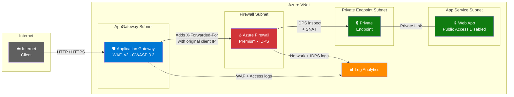

# Application Gateway (WAF) → Azure Firewall → Web App

[](https://learn.microsoft.com/en-us/azure/azure-resource-manager/bicep/)
[](https://azure.microsoft.com)

End-to-end **Azure Bicep** deployment that places **Application Gateway with WAF_v2** in front of **Azure Firewall Premium**, routing traffic to an **Azure Web App** accessible only via **Private Endpoint** — while preserving the original client IP through the `X-Forwarded-For` header.

## 📐 Architecture



### How Traffic Flows

```
Client (your public IP)
  │
  ▼
Application Gateway (WAF_v2)     ← Adds X-Forwarded-For header with your real IP
  │
  ▼  UDR routes traffic through Firewall
Azure Firewall (Premium)         ← IDPS inspection · SNATs traffic for symmetric routing
  │
  ▼
Private Endpoint → Web App       ← Reads original client IP from X-Forwarded-For ✅
```

> **Key insight:** Azure Firewall changes the network-level source IP (SNAT), but the
> `X-Forwarded-For` HTTP header — set by Application Gateway — is preserved untouched,
> because the firewall operates at L3/L4 and does not modify L7 headers.

## ✨ Features

| Capability | Implementation |
|------------|----------------|
| **L7 WAF Protection** | Application Gateway WAF_v2 with OWASP 3.2 + Bot Manager rules |
| **L3/L4 Inspection** | Azure Firewall Premium with IDPS signature detection |
| **Client IP Preservation** | `X-Forwarded-For` header set by App Gateway, untouched by Firewall |
| **Zero Public Access** | Web App `publicNetworkAccess: Disabled` — Private Endpoint only |
| **Symmetric Routing** | Firewall SNAT forced via `privateRanges: 255.255.255.255/32` |
| **Full Audit Trail** | Log Analytics with App Gateway access/WAF logs + Firewall logs |

## 📁 Project Structure

```
├── main.bicep                      # Orchestration — wires all modules together
├── deploy.ps1                      # One-command deployment script
├── verify-xff.ps1                  # Automated X-Forwarded-For verification
├── create_pptx.py                  # Generates PowerPoint presentation
├── DEMO-WALKTHROUGH.md             # Step-by-step demo guide
└── modules/
    ├── networking.bicep             # VNet, 4 subnets, NSGs, route table
    ├── firewall.bicep               # Azure Firewall Premium, policy, IDPS
    ├── appgateway.bicep             # App Gateway WAF_v2, WAF policy
    ├── webapp.bicep                 # App Service Plan, Web App, Private Endpoint, DNS
    ├── existing-webapp.bicep        # Variant: integrate with an existing Web App
    ├── routes.bicep                 # UDR: App Gateway subnet → Firewall next hop
    └── loganalytics.bicep           # Log Analytics + diagnostic settings
```

## 🚀 Quick Start

### Prerequisites

- [Azure CLI](https://learn.microsoft.com/en-us/cli/azure/install-azure-cli) (v2.50+)
- [Bicep CLI](https://learn.microsoft.com/en-us/azure/azure-resource-manager/bicep/install) (v0.24+)
- An Azure subscription with sufficient quota for:
  - Azure Firewall Premium
  - Application Gateway WAF_v2
  - App Service Plan (Linux)

### Deploy

```powershell
# Login to Azure
az login

# Deploy (defaults to westus2)
.\deploy.ps1 -ResourceGroupName "rg-appgw-fw-demo" -Location "westus2"
```

The deployment takes approximately **15–20 minutes** (Azure Firewall is the longest provisioning step).

### Verify

```powershell
# Automated verification of X-Forwarded-For preservation
.\verify-xff.ps1 -ResourceGroupName "rg-appgw-fw-demo"
```

Or test manually with `curl`:

```bash
# ✅ Access through App Gateway — returns 200 with echo headers
curl http://<APP_GATEWAY_PUBLIC_IP>

# ❌ Direct access to Web App — returns 403 (public access disabled)
curl https://<WEBAPP_NAME>.azurewebsites.net

# ❌ WAF blocks SQL injection — returns 403
curl "http://<APP_GATEWAY_PUBLIC_IP>/?id=1 OR 1=1"

# ❌ WAF blocks XSS — returns 403
curl "http://<APP_GATEWAY_PUBLIC_IP>/?q=<script>alert(1)</script>"
```

> Replace `<APP_GATEWAY_PUBLIC_IP>` and `<WEBAPP_NAME>` with values from the deployment output.

### Generate Presentation

```bash
pip install python-pptx
python create_pptx.py
```

Edit the configuration variables at the top of `create_pptx.py` with your deployment values before generating.

## 📊 Log Queries

After deployment, use these KQL queries in **Log Analytics** (`<appName>-law`):

**App Gateway Access Logs** — see real client IPs:
```kql
AzureDiagnostics
| where ResourceType == "APPLICATIONGATEWAYS"
| where Category == "ApplicationGatewayAccessLog"
| project TimeGenerated, clientIP_s, requestUri_s, httpStatus_d, serverRouted_s
| order by TimeGenerated desc
```

**WAF Logs** — see blocked attacks:
```kql
AzureDiagnostics
| where Category == "ApplicationGatewayFirewallLog"
| project TimeGenerated, clientIp_s, ruleId_s, action_s, Message
| order by TimeGenerated desc
```

**Azure Firewall Network Logs:**
```kql
AZFWNetworkRule
| project TimeGenerated, SourceIp, DestinationIp, DestinationPort, Protocol, Action
| order by TimeGenerated desc
```

## 🔗 Microsoft References

| Resource | Link |
|----------|------|
| **Reference Architecture** | [Azure Firewall and Application Gateway for virtual networks](https://learn.microsoft.com/en-us/azure/architecture/example-scenario/gateway/firewall-application-gateway) |
| **WAF on App Gateway** | [Web Application Firewall overview](https://learn.microsoft.com/en-us/azure/web-application-firewall/ag/ag-overview) |
| **Azure Firewall Premium** | [Premium features (IDPS, TLS inspection)](https://learn.microsoft.com/en-us/azure/firewall/premium-features) |
| **Private Endpoints** | [App Service Private Endpoint](https://learn.microsoft.com/en-us/azure/app-service/networking/private-endpoint) |
| **X-Forwarded-For** | [How Application Gateway works — header modifications](https://learn.microsoft.com/en-us/azure/application-gateway/how-application-gateway-works#modifications-to-the-request) |
| **WAF Best Practices** | [Best practices for WAF on Application Gateway](https://learn.microsoft.com/en-us/azure/web-application-firewall/ag/best-practices) |
| **Well-Architected Framework** | [Application Gateway — reliability & security](https://learn.microsoft.com/en-us/azure/well-architected/service-guides/azure-application-gateway) |

## 🧹 Cleanup

```powershell
az group delete --name "rg-appgw-fw-demo" --yes --no-wait
```

## 📄 License

MIT — see [LICENSE](LICENSE) for details.
